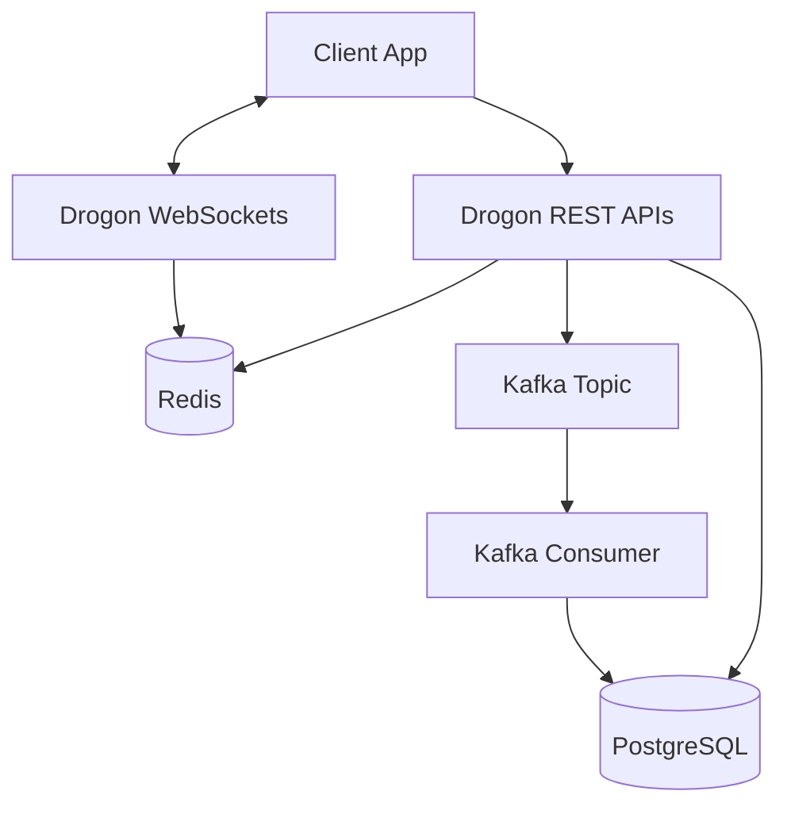

# Distributed Ride-Hailing Backend

A distributed ride-hailing backend built in C++ as a portfolio project. It emphasizes clean architecture and handles core flows such as authentication, driver management, ride lifecycle state machine, and real-time location updates.

## Tech Stack
C++, Drogon, PostgreSQL, Redis, Apache Kafka, WebSockets, Docker, JWT, REST APIs

## Architecture Overview


## Setup Instructions

1. **Clone the repository**
2. **Copy `.env.example` to `.env`** and update variables if necessary.
3. **Run using Docker Compose:**
   ```bash
   docker-compose up --build
   ```

## Current Status / Roadmap
- [x] Phase 1: Project Scaffolding
- [x] Phase 2: Auth Service (Signup/Login, JWT)
- [x] Phase 3: Driver Management (Geospatial tracking via Redis)
- [x] Phase 4: Ride Lifecycle & Real-time Updates (Kafka, WebSockets)
- [x] Phase 5: Final Polish (Exception handling & Structured logging)

## API Documentation
- `POST /auth/signup`
- `POST /auth/login`
- `PATCH /drivers/status`
- `PATCH /drivers/location`
- `GET /drivers/nearby`
- `POST /rides/request`
- `GET /rides/:id`
- `POST /rides/:id/cancel`
- `WS /ws/rides`
