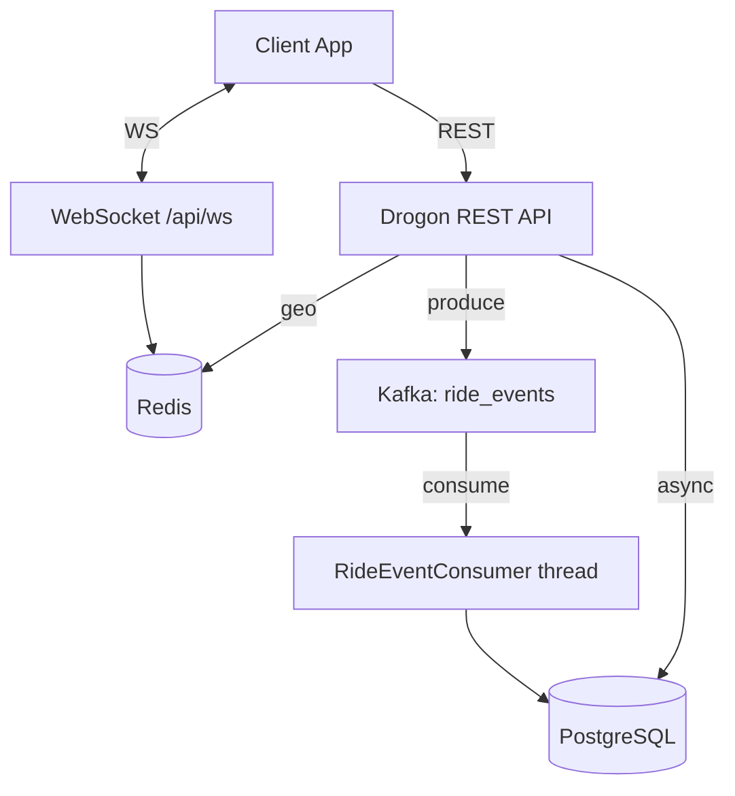

# Distributed Ride-Hailing Backend

A production-grade distributed ride-hailing backend built in **C++** as a portfolio project.
It demonstrates a microservice-style architecture with real-time communication, async processing, and clean layered code organization.

## Tech Stack

| Layer | Technology |
|---|---|
| HTTP Framework | [Drogon](https://github.com/drogonframework/drogon) (C++) |
| Database | PostgreSQL 15 |
| Cache / Geo | Redis 7 (driver location via GEO commands) |
| Event Streaming | Apache Kafka 3.7 (KRaft mode) |
| Real-time | WebSockets (Drogon built-in) |
| Auth | JWT (jwt-cpp + HS256) |
| Containerization | Docker / Docker Compose |

## Architecture



## Quick Start

```bash
# 1. Clone
git clone https://github.com/shahharshita78-cpu/ride-hailing-backend
cd ride-hailing-backend

# 2. Configure environment (optional — sensible defaults are provided)
cp .env.example .env

# 3. Build & run (first build takes ~5 min to compile C++ deps)
docker compose up --build

# 4. Verify
curl http://localhost:8080/health
# → {"service":"ride-hailing-backend","status":"ok"}
```

## API Reference

### Auth
| Method | Path | Auth | Description |
|--------|------|------|-------------|
| `POST` | `/api/auth/register` | — | Register (role: PASSENGER or DRIVER) |
| `POST` | `/api/auth/login` | — | Login, returns JWT |

### Rides
| Method | Path | Auth | Description |
|--------|------|------|-------------|
| `POST` | `/api/rides` | PASSENGER JWT | Request a new ride |
| `GET` | `/api/rides/active` | JWT | Get caller's active ride |
| `GET` | `/api/rides/history` | JWT | Ride history (stub) |
| `GET` | `/api/rides/{id}` | JWT | Get ride by ID |
| `POST` | `/api/rides/{id}/accept` | DRIVER JWT | Accept a ride |
| `POST` | `/api/rides/{id}/start` | DRIVER JWT | Start the ride |
| `POST` | `/api/rides/{id}/complete` | DRIVER JWT | Complete the ride |
| `POST` | `/api/rides/{id}/cancel` | DRIVER/PASSENGER JWT | Cancel a ride |
| `POST` | `/api/rides/{id}/payment` | JWT | Process payment |
| `POST` | `/api/rides/{id}/rating` | JWT | Submit rating (1–5) |

### Drivers
| Method | Path | Auth | Description |
|--------|------|------|-------------|
| `GET` | `/api/drivers/{id}` | — | Get driver profile |
| `GET` | `/api/drivers/{id}/vehicle` | — | Get driver vehicle |

### Health
| Method | Path | Auth | Description |
|--------|------|------|-------------|
| `GET` | `/health` | — | Health check |

### WebSocket
Connect to `ws://localhost:8080/api/ws?token=<JWT>`

Send JSON messages:
```json
{ "action": "location", "lat": 12.9716, "lon": 77.5946 }
```
Passengers receive real-time driver location updates and ride status changes.

## Example: Full Ride Flow

```bash
# Register passenger
curl -X POST localhost:8080/api/auth/register \
  -H "Content-Type: application/json" \
  -d '{"name":"Alice","email":"alice@test.com","phone":"9000000001","password":"pass","role":"PASSENGER"}'

# Register driver
curl -X POST localhost:8080/api/auth/register \
  -H "Content-Type: application/json" \
  -d '{"name":"Bob","email":"bob@test.com","phone":"9000000002","password":"pass","role":"DRIVER"}'

# Request a ride (use passenger token)
curl -X POST localhost:8080/api/rides \
  -H "Authorization: Bearer <PASSENGER_TOKEN>" \
  -H "Content-Type: application/json" \
  -d '{"pickup":"Airport","destination":"Downtown","estimated_fare":200}'

# Accept the ride (use driver token)
curl -X POST localhost:8080/api/rides/<RIDE_ID>/accept \
  -H "Authorization: Bearer <DRIVER_TOKEN>"
```

## Run Smoke Tests

```bash
# Ensure the stack is running first
bash test_backend.sh
```

## Database Reset

```bash
docker compose down -v          # drops all volumes (data wiped)
docker compose up --build       # fresh start with init schema
```

## Project Structure

```
src/
├── main.cc                         # Drogon app entry point
├── controllers/
│   ├── HealthController.{h,cc}     # GET /health
│   ├── UserController.{h,cc}       # Auth: register, login
│   ├── RideController.{h,cc}       # Full ride lifecycle
│   ├── DriverController.{h,cc}     # Driver profile & vehicle
│   ├── PaymentController.{h,cc}    # Payment processing
│   ├── RatingController.{h,cc}     # Ride ratings
│   └── RideWebSocketController.{h,cc}  # Real-time WS hub
├── filters/
│   └── JwtFilter.{h,cc}            # JWT auth middleware
├── repositories/
│   ├── UserRepository.{h,cc}       # DB access: users
│   └── RideRepository.{h,cc}       # DB access: rides
├── consumers/
│   └── RideEventConsumer.{h,cc}    # Kafka consumer thread
├── utils/
│   ├── JwtUtils.{h,cc}             # JWT sign/verify
│   ├── CryptoUtils.{h,cc}          # Password hashing (SHA-256 + salt)
│   ├── KafkaUtils.{h,cc}           # Kafka producer helper
│   └── RedisUtils.{h,cc}           # Redis geo client helper
└── models/
    └── Models.h                    # C++ struct definitions
config/
└── config.json                     # Drogon listener + thread config
migrations/
└── 001_init_schema.sql             # Full PostgreSQL schema
docker/
└── Dockerfile                      # Multi-stage C++ build
```
